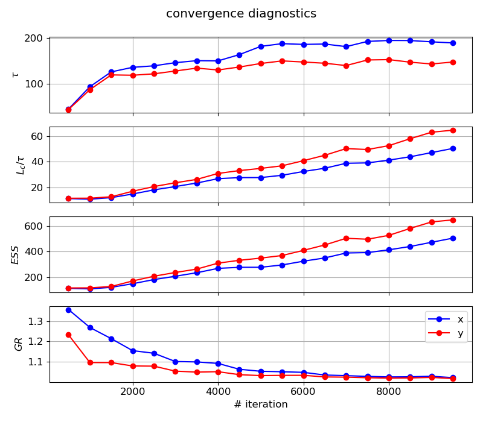

# slurmcmc

Perform model calibration with uncertainty quantification (also known as Bayesian model calibration) for models that require computationally expensive black-box queries, using parallel computing on a Slurm-managed cluster.
Implemented by stitching together [``submitit``](https://github.com/facebookincubator/submitit) + [``nevergrad``](https://github.com/facebookresearch/nevergrad) + [``botorch``](https://github.com/pytorch/botorch) + [``emcee``](https://github.com/dfm/emcee).


## Install

Install prerequisites:

```
pip install submitit nevergrad botorch emcee corner
```

Install the package locally using
```
pip install -e .
```

Run tests from root project folder using:
```
pytest -vv tests
```

To run a specific test, for example
```
pytest -vv tests/test_map_local.py::test_slurmpool_localmap
```

## Parallelization

The algorithms used are based on parallel evaluations of functions, which we want to perform on Slurm-managed cluster.
The run options determined by the  `cluster` argument whose options are:
* `'slurm'`: parallel evaluations using jobs submitted to Slurm via [``submitit``](https://github.com/facebookincubator/submitit).
* `'local'`: parallel evaluations using local processes, also via [``submitit``](https://github.com/facebookincubator/submitit) (on the same directories structure as in `'slurm'`, useful for debugging).
* `'local-map'`: evaluate function in-line sequentially on multiple points. Useful for analytic functions where 
parallelization is less important, for demonstrations and for debugging. 
This mode is used in the examples below for quick evaluations.


## Examples

### Optimization

This example's plots are generated using [example_optimization.py](examples/example_optimization.py).

We choose the loss function as the 2d-rosenbrock function, with a circle constraint. 
The parallel optimization algorithm used in this case is [Differential Evolution](https://en.wikipedia.org/wiki/Differential_evolution) via [``nevergrad``](https://github.com/facebookresearch/nevergrad)
(other parallel optimization options are [Particle Swarm Optimization](https://en.wikipedia.org/wiki/Particle_swarm_optimization) via [``nevergrad``](https://github.com/facebookresearch/nevergrad) 
or [Bayesian Optimization](https://en.wikipedia.org/wiki/Bayesian_optimization) via [``botorch``](https://github.com/pytorch/botorch)).

We pick 10 workers times 30 iterations. Progression of the loss with the number of iterations:


2d visualization of the loss function, the circle constraint (white line), and the points approaching (dark to bright) the minima (marked by a star):


In the example above the number of iterations was arbitrary, but for model calibration the loss function should be a 
measure of the model's fit to data, and the optimization goal is to reach a statistically satisfactory value before 
proceeding to the Bayesian analysis.

### Bayesian analysis (MCMC)

This example's plots are generated using [example_mcmc.py](examples/example_mcmc.py).

We choose the log-probability function as minus the 2d-rosenbrock function, with zero probability assigned outside of 
the constraint circle.
The parallel ensemble MCMC algorithm is via [``emcee``](https://github.com/dfm/emcee).

We pick the initial points to initiate the MCMC chains (or workers) at random, but a for an expensive black-box query 
in higher dimension an optimization should be done first, and the initial points chosen around the minima.

We pick $N_c=10$ chains times $L_c=10^4$ iterations per chain. 
Progress of the chains with iterations (after some burn-in):


The MCMC results require testing convergence diagnostics, as discussed in the [emcee docs](https://emcee.readthedocs.io/en/stable/tutorials/autocorr/):

* The integrated auto-correlation time $\tau$ needs to be calculated (per parameter). 
It is advised that the length of each chain $L_c$ to be over $50\tau$ to trust the estimation.
(note that $\tau$ itself usually increases with $L_c$ until it saturates and converges so $L_c/\tau$ 
does not simply rise proportionally to $L_c$)
In `emcee` the calculation of $\tau$ uses all parallel chains to increase the estimation accuracy, 
but additional chains do not necessarily help $\tau$ converge faster (with smaller $L_c$).

* The effective sample size (ESS) defined as the total number of samples divided by the 
auto-correlation time $ESS=N_{total}/\tau=N_c \times L_c/\tau$ is advised to be 10-100 times the number of parameters.
In this case the ESS will scale proportionally to the number of parallel chains $N_c$.

* The [Gelman-Rubin statistic](https://pymcmc.readthedocs.io/en/latest/modelchecking.html) is another convergence metric that approaches 1 when converged. However, it is not 
relevant for the ensemble MCMC algorithm because the chains are inherently correlated, but it can be a supplamentary 
diagnostic. 

All the mentioned metrics are shown per parameter in the legend of the figure above, and their dependence on the chain 
length $L_c$:




2d visualization of the points visited by the algorithm (black) and the points accepted to the MCMC samples set (red):


The final product of the Bayesian analysis, a [``corner``](https://github.com/dfm/corner.py) plot of the parameters distribution:

