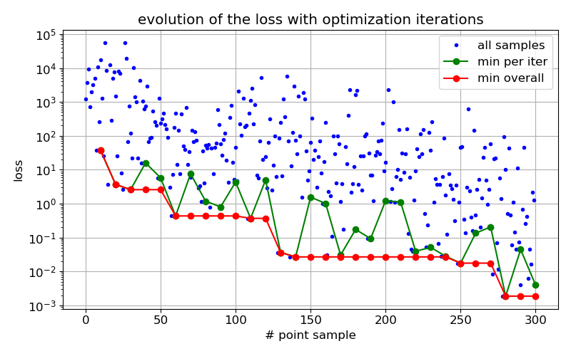
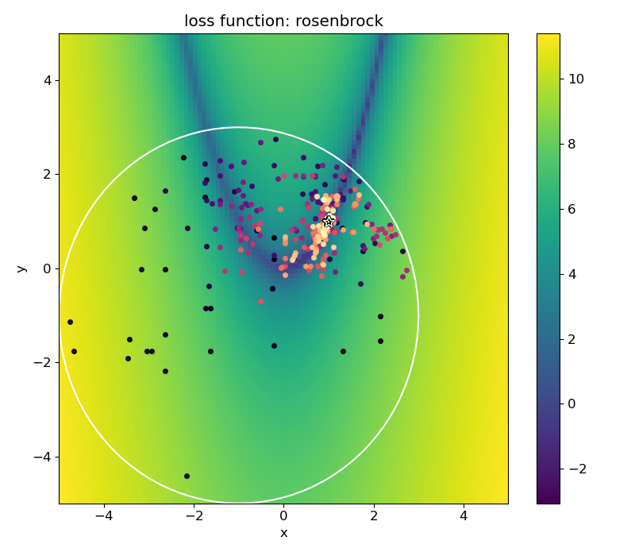
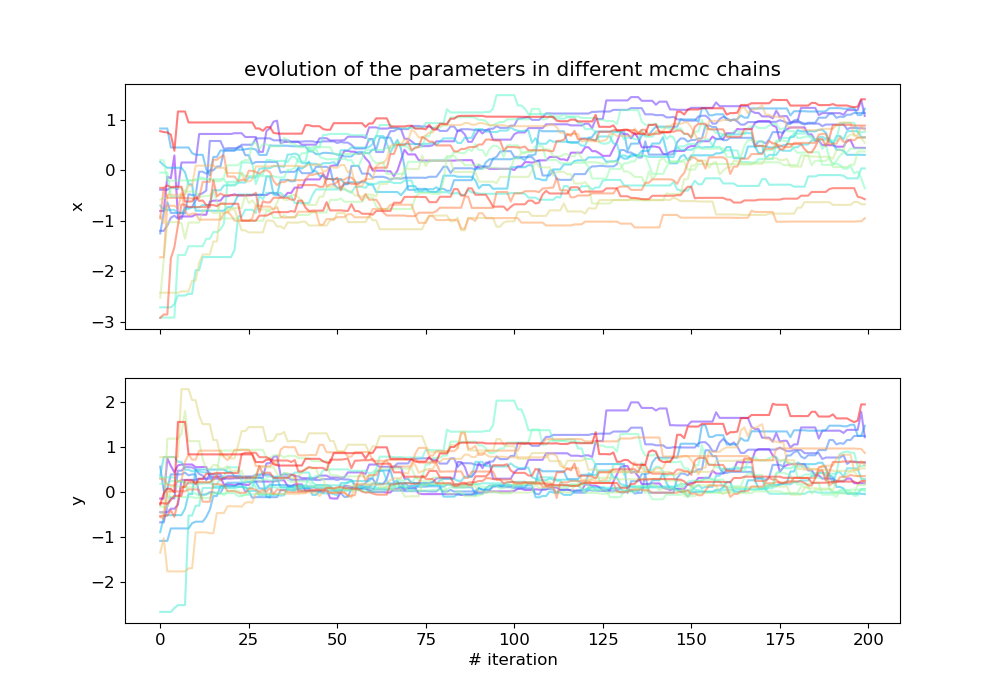
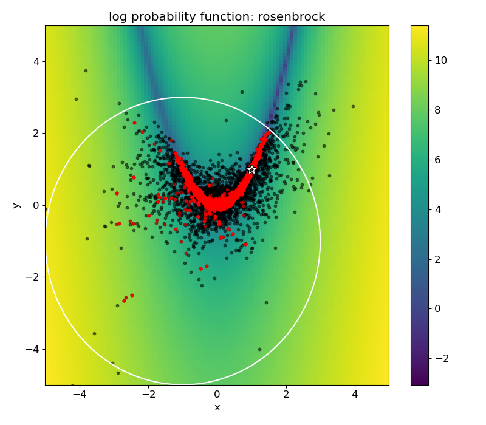
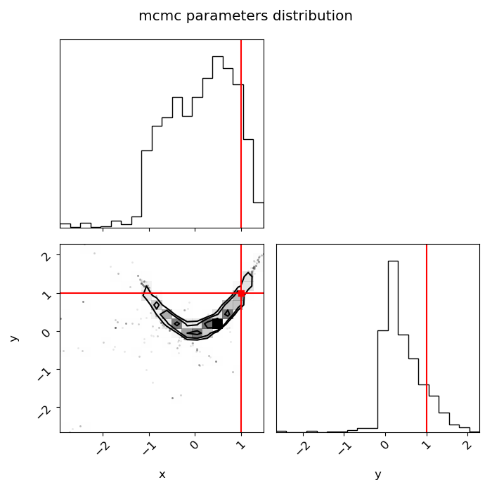

# slurmcmc

Perform model calibration with uncertainty quantification (also known as Bayesian model calibration) for models that require computationally expensive black-box queries, using parallel computing on a Slurm-managed cluster.
Implemented by stitching together [``submitit``](https://github.com/facebookincubator/submitit) + [``nevergrad``](https://github.com/facebookresearch/nevergrad) + [``botorch``](https://github.com/pytorch/botorch) + [``emcee``](https://github.com/dfm/emcee).


## Install

Install locally using
```
pip install -e .
```

Run tests from root project folder using:
```
pytest tests
```

Run a specific test
```
pytest tests/test_file.py::TestClassName::test_method_name
```

## Examples

Quick how to use in the examples folder, that create the plots shown below.

The examples do not use Slurm but emulate it for quick evaluations (using `cluster='local-map'` instead of `'local'` or `'slurm'`).

### Optimization

We choose the loss function as the 2d-rosenbrock function, with a circle constraint. 
The parallel optimization algorithm used in this case is Differential Evolution via [``nevergrad``](https://github.com/facebookresearch/nevergrad).

Progression of the loss with the number of iterations:


2d visualization of the loss function, the circle constraint, and the points approaching (dark to bright) the minima (marked by a star):


### Bayesian analysis (MCMC)

We choose the log-probability function as minus the 2d-rosenbrock function, with zero probability assigned outside of the constraint circle.
The parallel MCMC algorithm via [``emcee``](https://github.com/dfm/emcee).

Progress of the chains with iterations (without burn-in or thinning):


2d visualization of the points visited by the algorithm (black) and the points accepted to the MCMC samples (red):


The final product of the Bayesian analysis, a [``corner``](https://github.com/dfm/corner.py) plot of the parameters distribution:
