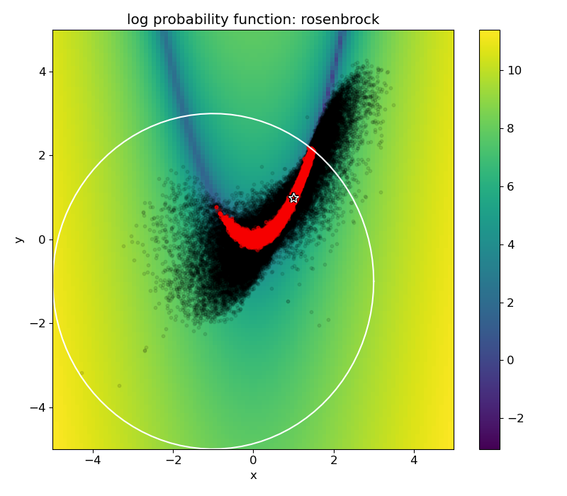

# slurmcmc

Perform model calibration with uncertainty quantification (also known as Bayesian model calibration) for models that require computationally expensive black-box queries, using parallel computing on a Slurm-managed cluster.
Implemented by stitching together [``submitit``](https://github.com/facebookincubator/submitit) + [``nevergrad``](https://github.com/facebookresearch/nevergrad) + [``botorch``](https://github.com/pytorch/botorch) + [``emcee``](https://github.com/dfm/emcee).


## Install

Install prerequisites:

```
pip install submitit nevergrad botorch emcee corner
```

Install the package locally using
```
pip install -e .
```

Run tests from root project folder using:
```
pytest tests
```

Run a specific test
```
pytest tests/test_file.py::TestClassName::test_method_name
```

## Parallelization

The algorithms used are based on parallel evaluations of functions, which we want to perform on Slurm-managed cluster.
The run options determined by the  `cluster` argument whose options are:
* `'slurm'`: parallel evaluations using jobs submitted to Slurm via [``submitit``](https://github.com/facebookincubator/submitit).
* `'local'`: parallel evaluations using local processes, also via [``submitit``](https://github.com/facebookincubator/submitit).
* (on the same directories structure as in `'slurm'`, useful for debugging).
* `'local-map'`: evaluate function in-line sequentially on multiple points. Useful for analytic functions where 
parallelization is less important, for demonstrations and for debugging. 
This mode is used in the examples below for quick evaluations.


## Examples

### Optimization

This example's plots are generated using [example_optimization.py](examples/example_optimization.py).

We choose the loss function as the 2d-rosenbrock function, with a circle constraint. 
The parallel optimization algorithm used in this case is [Differential Evolution](https://en.wikipedia.org/wiki/Differential_evolution) via [``nevergrad``](https://github.com/facebookresearch/nevergrad)
(other parallel optimization options are [Particle Swarm Optimization](https://en.wikipedia.org/wiki/Particle_swarm_optimization) via [``nevergrad``](https://github.com/facebookresearch/nevergrad) 
or [Bayesian Optimization](https://en.wikipedia.org/wiki/Bayesian_optimization) via [``botorch``](https://github.com/pytorch/botorch)).

Progression of the loss with the number of iterations:


2d visualization of the loss function, the circle constraint (white line), and the points approaching (dark to bright) the minima (marked by a star):


### Bayesian analysis (MCMC)

This example's plots are generated using [example_mcmc.py](examples/example_mcmc.py).

We choose the log-probability function as minus the 2d-rosenbrock function, with zero probability assigned outside of the constraint circle.
The parallel MCMC algorithm via [``emcee``](https://github.com/dfm/emcee).

We pick the initial points to initiate the MCMC chains at random, but a for an expensive black-box query in higher dimension an optimization should be done first, and the initial points chosen around the minima.

Progress of the chains with iterations (without burn-in or thinning):


2d visualization of the points visited by the algorithm (black) and the points accepted to the MCMC samples set (red):


The final product of the Bayesian analysis, a [``corner``](https://github.com/dfm/corner.py) plot of the parameters distribution:

