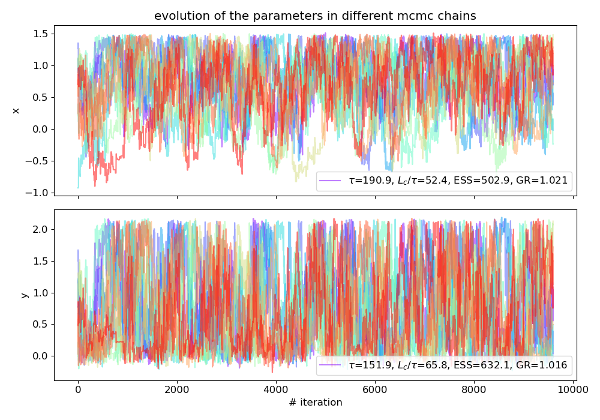
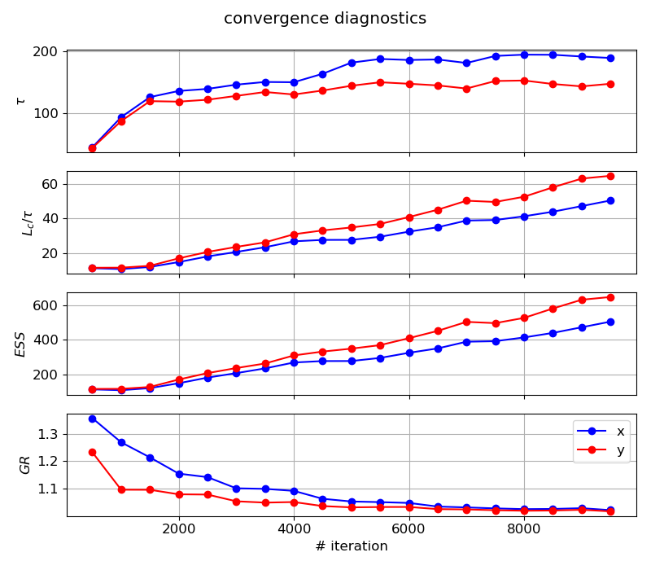
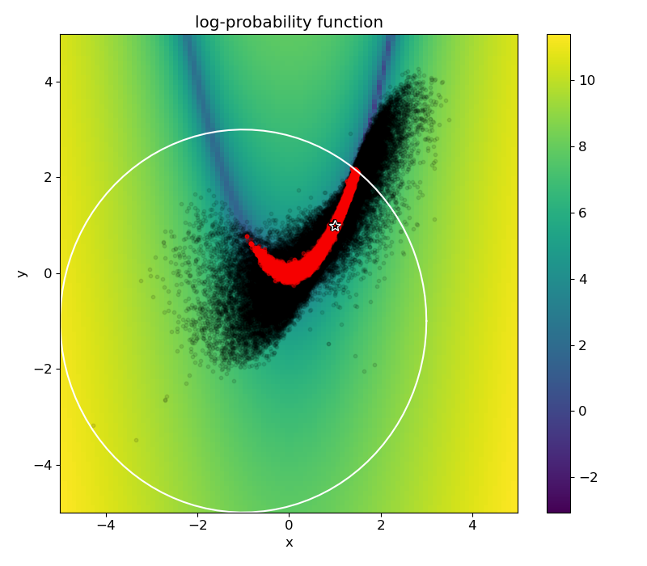
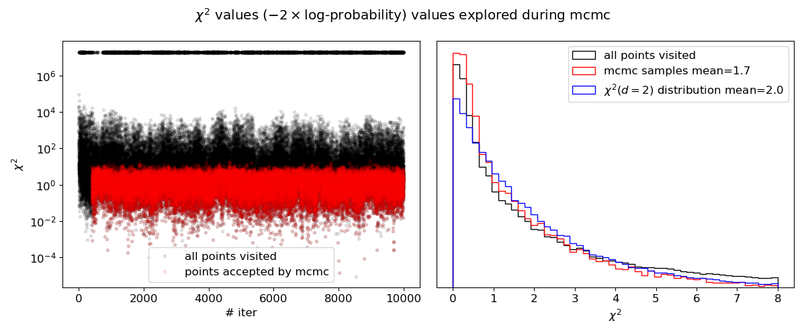
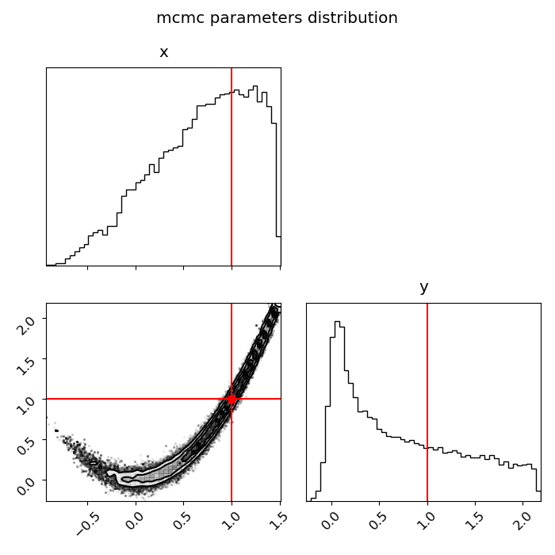
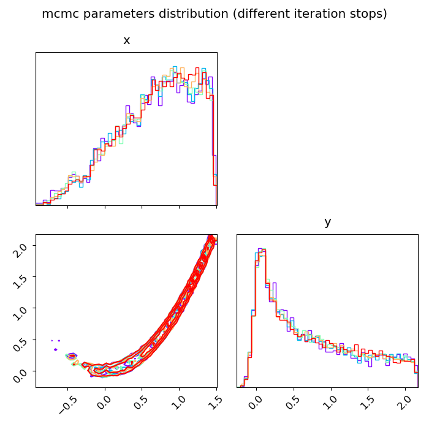

## MCMC

The heart of Bayesian model calibration (BMC) or Bayesian parameter estimation is to find the probability distribution 
of the model parameters. 
For high-dimension problems Markov chain Monte Carlo (MCMC) is a class of algorithms that aim to find this 
distribution efficiently.

---

This example's plots are generated using [example_mcmc.py](../example_mcmc.py).

We choose the log-probability function as minus the 2d-rosenbrock function, with zero probability assigned outside of 
the constraint circle (as defined in the [optimization example](examples/docs/optimization.md)).
The parallel ensemble MCMC algorithm is via [``emcee``](https://github.com/dfm/emcee).

We pick the initial points to initiate the MCMC chains (or workers) at random, but a for an expensive black-box query 
in higher dimension an optimization should be done first, and the initial points chosen around the minima.

We pick $N_c=10$ chains times $L_c=10^4$ iterations per chain. 
Progress of the chains with iterations (after some burn-in):

The MCMC results require testing convergence diagnostics, as discussed in the [emcee docs](https://emcee.readthedocs.io/en/stable/tutorials/autocorr/):

* The integrated auto-correlation time $\tau$ needs to be calculated (per parameter). 
It is advised that the length of each chain $L_c$ to be over $50\tau$ to trust the estimation.
(note that $\tau$ itself usually increases with $L_c$ until it saturates and converges so $L_c/\tau$ 
does not simply rise proportionally to $L_c$)
In `emcee` the calculation of $\tau$ uses all parallel chains to increase the estimation accuracy, 
but additional chains do not necessarily help $\tau$ converge faster (with smaller $L_c$).

* The effective sample size (ESS) defined as the total number of samples divided by the 
auto-correlation time $ESS=N_{total}/\tau=N_c \times L_c/\tau$ is advised to be 10-100 times the number of parameters.
In this case the ESS will scale proportionally to the number of parallel chains $N_c$.

* The [Gelman-Rubin statistic](https://pymcmc.readthedocs.io/en/latest/modelchecking.html) is another convergence metric that approaches 1 when converged. However, it is not 
relevant for the ensemble MCMC algorithm because the chains are inherently correlated, but it can be a supplamentary 
diagnostic. 

All the mentioned metrics are shown per parameter in the legend of the figure above, and their dependence on the chain 
length $L_c$:

2d visualization of the log-probability function (log absolute of the values), 
the points visited by the algorithm (black) and the points accepted to the MCMC samples set (red):

Aother visualization is to look at $\chi^2=-2\cdot \log p$ values evolution during the MCMC, 
and the histogram of the values accepted to the MCMC samples set (red).

The histogram can be compared with the one generated from a $\chi^2$ distribution in 2 dimensions (blue).
The means of both distributions are numerically calculated and written in the legend (the analytic value for the mean of the $\chi^2$ distribution should be the dimension). 

The final product of the Bayesian analysis is a [``corner``](https://github.com/dfm/corner.py) plot of the parameters distribution:

A convergence test of the parameters distributions, assuming the MCMC is stopped at 5 different points along the chains (progression in colors going from purple to red):

