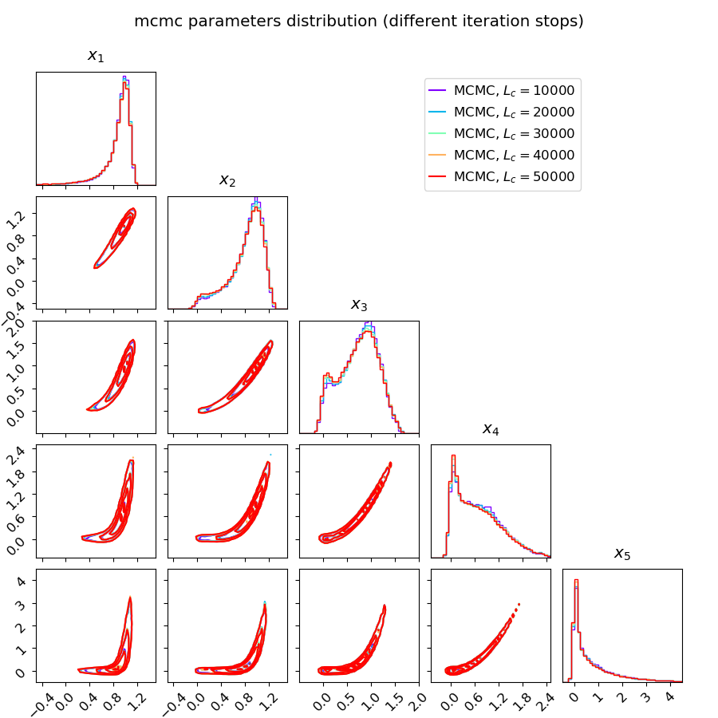
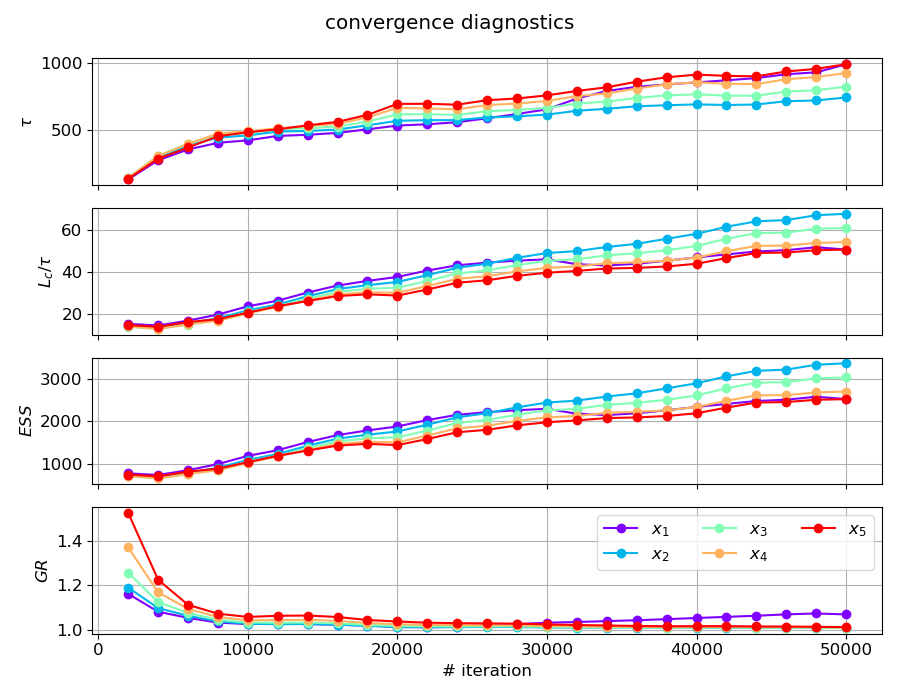
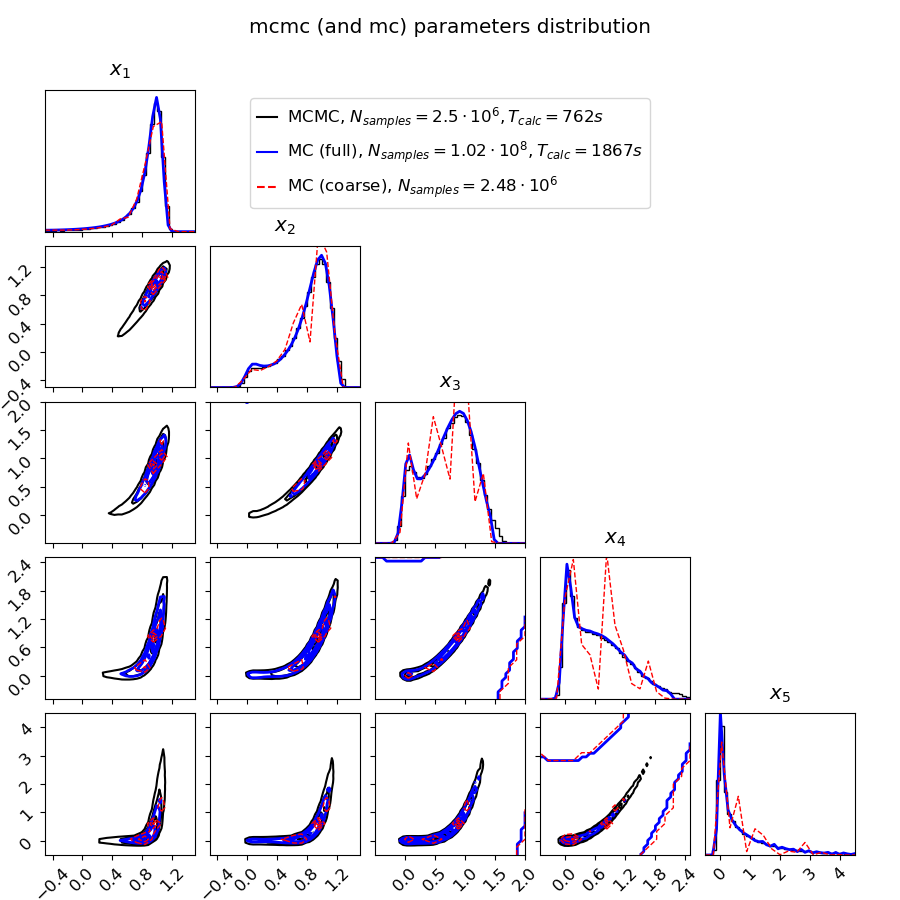

## Comparing MCMC and MC

This example's plots are generated using [example_mcmc_and_mc_comparison.py](../example_mcmc_and_mc_comparison.py).

We choose the log-probability function as minus the 5d-Rosenbrock function (as defined in the [optimization algorithms comparison example](optimization_algorithms_comparison.md)).
The parallel ensemble MCMC algorithm is via [``emcee``](https://github.com/dfm/emcee).

We pick $N_c=50$ chains times $L_c=5 \cdot 10^4$ iterations per chain. 
Initial points chosen close to the theoretical minimum.
The final product of the Bayesian analysis is a [``corner``](https://github.com/dfm/corner.py) plot of the parameters distributions.

A convergence test of the parameters distributions, assuming the MCMC is stopped at 5 different points along the chains (without any burn-in):

Additional convergence diagnostics (as defined in the [MCMC example](mcmc.md)):

Compare the resulting probability distributions from MCMC to one calculated using brute-force grid-based Monte-Carlo (MC):

Notes:
- In black we show the MCMC distribution as calculated above, and in blue the MC distribution, 
with the corresponding total number of samples and calculation time for each written in the legend.
- In the MC case $\sim 40 \times$ more total samples were drawn compared to MCMC. 
Interestingly, the total calculation time was only $\sim 2.5 \times$ longer (algorithm and implementation overhead).
- Also, in red we show the MC distribution from a coarser grid, such that the total number of samples is approximately the same as for MCMC.
It can be clearly seen that the distribution is far from converged in this case, demonstrating the sampling efficiency of MCMC algorithms.