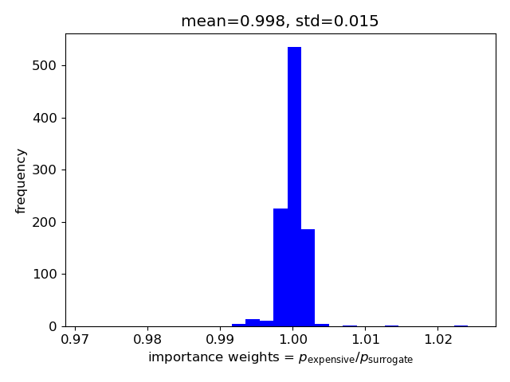

## MCMC with surrogate

MCMC usually requires many samples so for expensive black-box queries it could be prohibitive.
Therefore, one can first train a fast surrogate/emulator based on few points (relative to the MCMC scale),
and use it instead.
Once the fast surrogate is built, this package becomes obsolete and the MCMC can be carried out independently 
using any MCMC package, for example  [``emcee``](https://github.com/dfm/emcee) or [``pymc``](https://github.com/pymc-devs/pymc).

To build the surrogate model one requires training data, which could be acquired by sampling the parameter space randomly
(on a wide enough domain).
After training, the accuracy of the surrogate needs to be tested, for example by cross-validation 
(splitting the data to train and test sets).
However, even if the accuracy is satisfactory on the test set, it might not be as accurate on the post-MCMC subspace 
(which is not known in advance).

Therefore, using this package could still be useful as a tool to generate training data close to the post-MCMC subspace.
Meaning, a hybrid approach would to take the following steps: 
1. Start the parallel MCMC with the expensive queries.
2. Generate enough relevant data.
3. Train a fast surrogate model (and test its accuracy).
4. Restart MCMC with the fast surrogate (parallelization no longer needed).
5. Validate the resulting parameter distribution (importance sampling).

-----

This example's plots are generated using [example_mcmc_surrogate.py](../example_mcmc_surrogate.py).

As in the previous [MCMC example](mcmc.md), we choose the log-probability function as minus the 2d-rosenbrock function, 
with zero probability assigned outside of the constraint circle. 
This will serve as the "expensive" query, to demonstrate the procedure above.

We pick $N_c=10$ chains times $L_c=2000$ iterations per chain 
(is not enough to be converged but that is not the point), and run the MCMC.

Then, we train a (gaussian process) surrogate model for the log-probability values of the training set, 
made from 250 samples from the previous MCMC, 
and additional 250 random points (in the constrained domain) as regularization.

For visualization, we show the expensive and surrogate log-probability functions, 
with the training points shown in red:

We can see that the training data points are focused where we want them to be.

Rerun the MCMC (with the same parameters as before) but using the surrogate model.
A corner plot of the MCMC parameter distributions for the expensive vs surrogate cases (after some burn-in):

We can see that the distributions are quite similar in this toy example.

For validation, pick 1000 samples from the surrogate-MCMC set, and evaluate the expensive queries on those points.
Compare the ratio of probabilities between the expensive and surrogate cases (top), 
and the correlation between the ratio and the log-probability itself (bottom):

We can see that the ratio is close to 1 to within 1%, validating the use of the surrogate model in this example. 

Later, these probability ratios (also known as importance weights) could be used to improve the accuracy of the 
predictions based on the (surrogate based) MCMC samples set.
