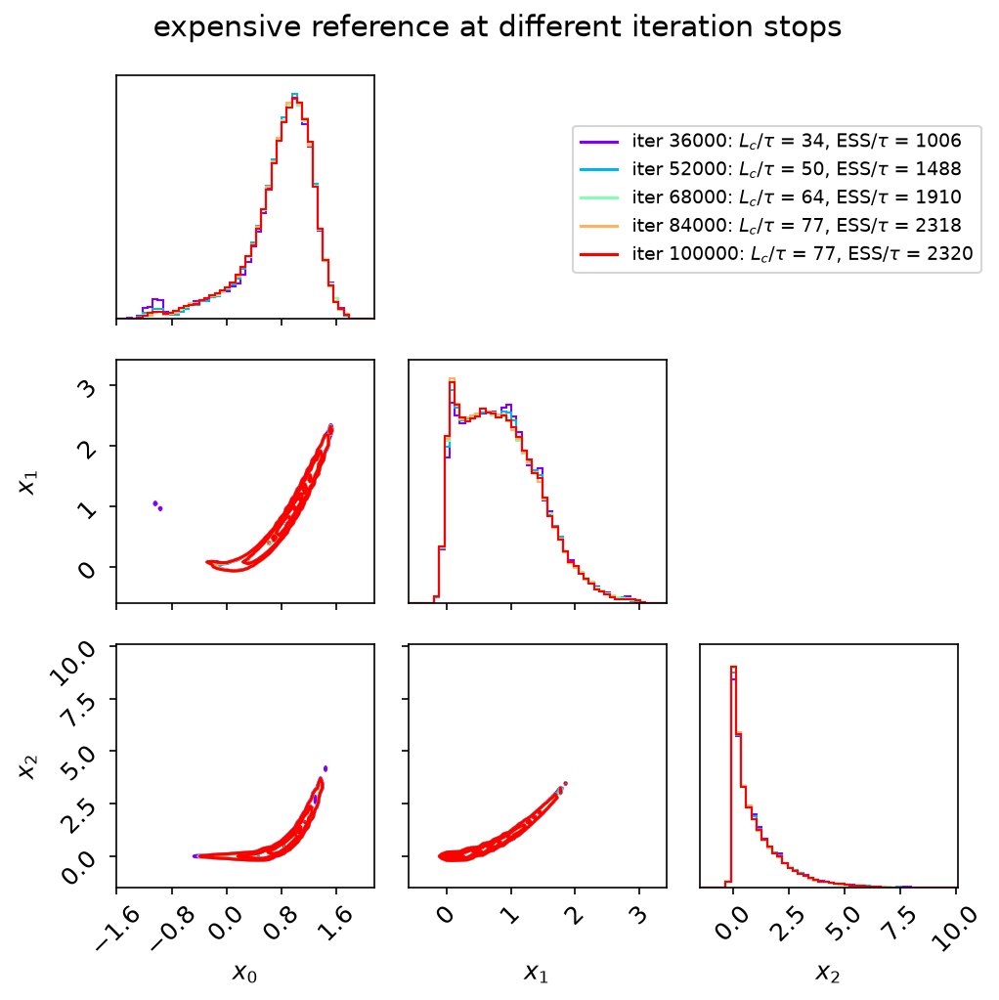
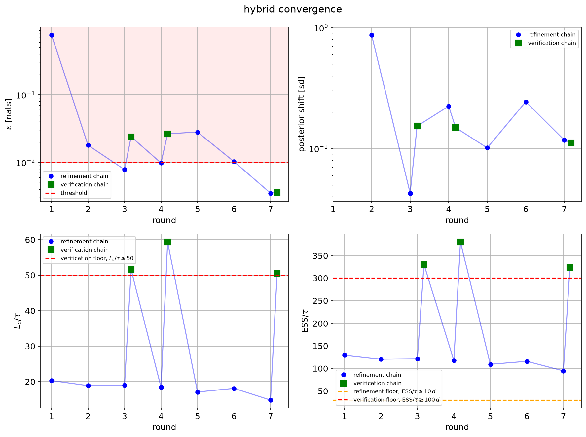
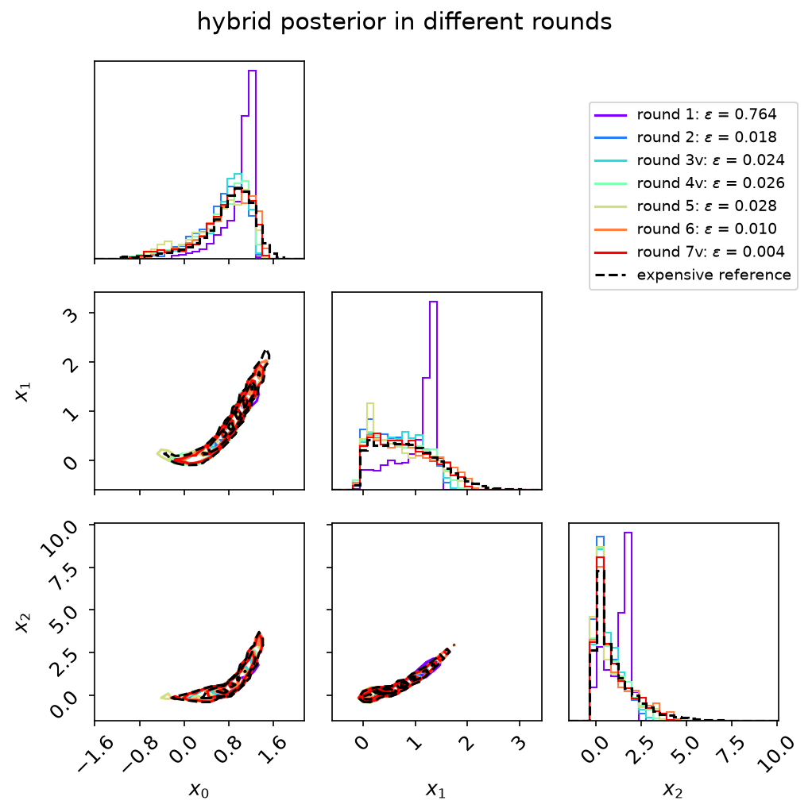
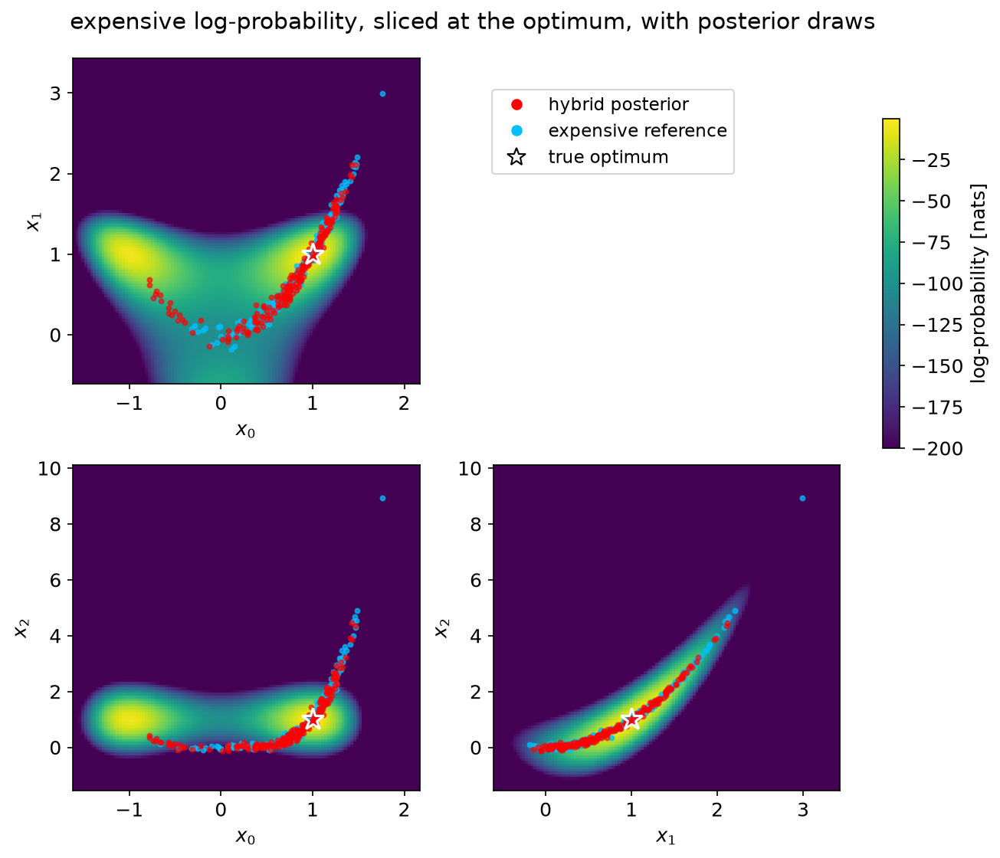
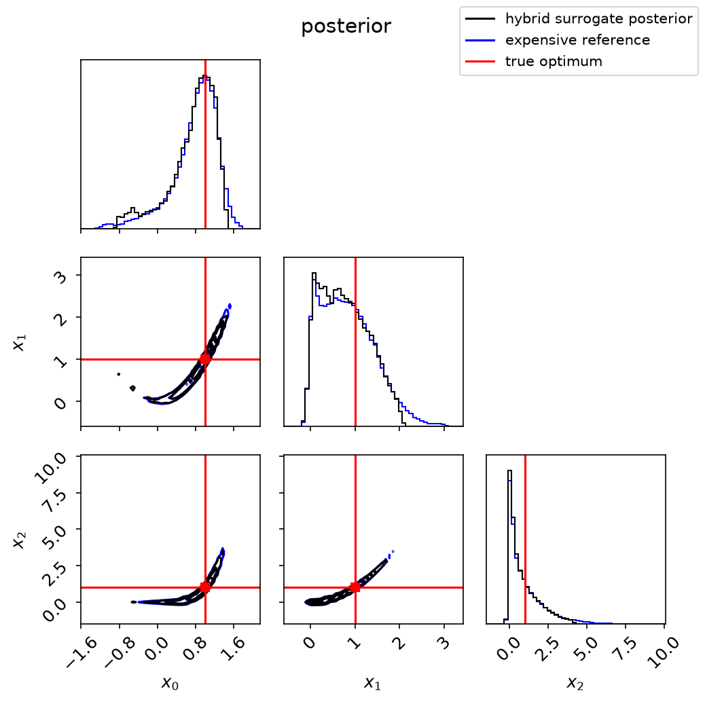

## MCMC with surrogate (automated hybrid pipeline)

[mcmc_surrogate.md](mcmc_surrogate.md) describes the manual two-step procedure: evaluate the
expensive model, fit a surrogate, sample the surrogate. Its weakness is that nothing tells you
how many expensive evaluations were enough, or whether the surrogate posterior is the real one.

`slurm_mcmc_hybrid` automates it, iterating until measured criteria say to stop.

[example_mcmc_hybrid.py](../example_mcmc_hybrid.py) is a runnable template for the whole
thing: a 3D Rosenbrock, every argument spelled out on its own line, and the figures shown
below. Copy it and replace `log_prob_fun`.

Requires the `hybrid` extra: `pip install -e ".[hybrid]"` (scikit-learn).

### The loop

1. **Round 0.** A *short* expensive MCMC, plus optional `num_regularization_points`, generates
   the initial training set. Its walkers — the parallel MCMC chains, $N_c$ in [mcmc.md](mcmc.md) —
   are evaluated in parallel on the cluster, so their number is this stage's cluster parallelism.
   The regularization points are the only evaluations in the whole run placed without reference to
   a posterior, and so the only ones that can find mass the surrogate does not already know about.

   **Starting from existing evaluations.** If expensive evaluations already exist — from an
   ordinary `slurm_mcmc` run, a parameter scan, an earlier study — pass them as
   `initial_train_points` and `initial_train_values`. Round 0 is then skipped entirely and the
   first surrogate is fitted on them directly, and `init_points` is not needed. They do not count
   towards `num_expensive_evals`, which records only what the run itself spent. From a previous
   `slurm_mcmc`:

   ```python
   pool = status['slurm_pool']
   result = slurm_mcmc_hybrid(..., initial_train_points=pool.points_history,
                              initial_train_values=pool.values_history[:, 0])
   ```
2. **Fit** a fast surrogate — Gaussian process by default, polynomial or any custom
   `fit`/`predict` object also accepted.
3. **Sample** it with a cheap MCMC (vectorized, no cluster), confined either to `param_bounds` or,
   by default, to an envelope grown from the training data. A fresh sampler is built every round,
   because each round samples a *different* surrogate, and it uses its own deliberately small
   set of walkers (`num_surrogate_walkers`) rather than the expensive stage's. This chain is kept
   **cheap** — it only has to reach `refine_surrogate_ess` — because its posterior is thrown away
   at the next fit.
4. **Validate.** Evaluate the expensive function, in parallel, on `num_validation_points` drawn
   from the surrogate posterior, and score the criteria below.
5. **Refine.** If they are not all met, the validation evaluations — which sit exactly where the
   surrogate needs improving, and are already paid for — are recycled into the training set and
   the loop repeats. Optionally each round also runs a few expensive MCMC steps seeded from the
   current surrogate posterior (`num_expensive_iters_per_round`).
6. **Verify.** A pass reached on a cheap chain is only provisional. The same surrogate is
   re-sampled to reporting depth — `final_surrogate_ess` effective samples *and*
   $L_c \ge$ `final_iters_per_tau` $\cdot\,\tau$ — and one more validation batch is spent on
   *that* posterior. If it still passes, that is the posterior returned. If not, refinement
   resumes, up to `max_verification_attempts` times. Either way no evaluation is wasted: the
   refinement batch joins the training set as soon as verification starts, and a rejected
   verification's batch joins it too.

Verification buys two things. The posterior that is returned is sampled to reporting depth,
rather than being whatever a deliberately cheap chain happened to produce. And the decision to
stop rests on two independent measurements of $\varepsilon$ rather than one — which matters,
because a single measurement from a finite validation batch is noisy: two batches scored against
the *same* surrogate can land on opposite sides of the threshold.

### What is measured

On the validation points $\theta_i$, write the log-ratio and the self-normalised importance
weights:

$$
d_i = \log p_\mathrm{exp}(\theta_i) - \log p_\mathrm{sur}(\theta_i),
\qquad w_i = e^{d_i},
\qquad \tilde{w}_i = \frac{w_i}{\sum_j w_j}
$$

**Nats.** Every logarithm here is natural, and the unit of a log-probability is the *nat* — which
is what `[nats]` means on the figures below. A difference of $\Delta$ nats in log-probability is a
factor $e^{\Delta}$ in probability: 1 nat is a factor of 2.7, 0.1 nats about 10%, and 0.01 nats
about 1%.

The weights are the *ratio*, not the expensive density, because the points were drawn from the
surrogate posterior and so already arrive at density $\propto p_\mathrm{sur}$. The sampling
density has to be divided out before the target density is multiplied in. Had the points been
scattered uniformly, $p_\mathrm{exp}$ alone would have been the correct weight.

**Surrogate accuracy**, in nats:

$$
\bar{d} = \sum_i \tilde{w}_i d_i,
\qquad \varepsilon = \sqrt{\sum_i \tilde{w}_i (d_i - \bar{d})^2}
$$

$\varepsilon = 0.05$ means probability ratios are accurate to about 5%. The mean $\bar{d}$ is
subtracted because a log-probability is only defined up to a constant, so only the *spread* of
$d$ is a real error.

**Degeneracy guard.** $\varepsilon$ alone is not safe: if the weights collapse onto a few
points, it is computed from those points alone and can be arbitrarily small — *exactly zero* for
a single dominating point — while the surrogate is in fact terrible. The number of validation
points that effectively carry the weight is

$$
\mathrm{ESS}_w = \frac{\left(\sum_i w_i\right)^2}{\sum_i w_i^2} \in [1, N]
$$

and a run is never declared converged while $\mathrm{ESS}_w <$ `min_ess_weights`.

> **Naming.** ESS means something different for an MCMC chain — there it is $N/\tau$, the
> number of independent draws in an autocorrelated chain, as in [mcmc.md](mcmc.md).
> $\mathrm{ESS}_w$ is a count of validation points. The two are unrelated.

**Posterior stability.** Surrogate accuracy and posterior convergence are different
questions: a perfect surrogate still leaves a drifting posterior if the cheap chain is too
short. Between rounds, the change in each parameter's posterior mean $m_j$ and standard deviation
$s_j$ is measured in units of that parameter's posterior width, and the largest is kept:

$$
\delta = \max_j \frac{\max\left(\left|m_j^\mathrm{new} - m_j^\mathrm{old}\right|,\ \left|s_j^\mathrm{new} - s_j^\mathrm{old}\right|\right)}{\tfrac12\left(s_j^\mathrm{new} + s_j^\mathrm{old}\right)}
$$

$\delta = 0.1$ means nothing moved by more than a tenth of a posterior width — a statement about
the answer rather than about the chain. Two estimates of the *same* posterior still differ by
chance, by roughly $\sqrt{1/\mathrm{ESS}_\mathrm{new} + 1/\mathrm{ESS}_\mathrm{old}}$ widths, where
ESS is the chain's $N/\tau$ and "old" is the previous round's reported posterior. So the tolerance
actually applied, written $\delta_{\max}$ for `posterior_shift_tolerance`, never drops below three
times that:

$$
\delta \le \max\left(\delta_{\max},\ 3\sqrt{\frac{1}{\mathrm{ESS}_\mathrm{new}} + \frac{1}{\mathrm{ESS}_\mathrm{old}}}\right)
$$

Without that noise floor a tolerance of 0.1 would be unreachable at realistic chain depths: at the
ESS of 95–380 in the worked example, the floor alone is 0.23–0.42. The test needs two rounds, so
a run cannot converge in round 1 while it is enabled; `posterior_shift_tolerance=None` switches it
off.

All three must hold simultaneously:

$$
\varepsilon \le \varepsilon_{\max},
\qquad \mathrm{ESS}_w \ge \mathrm{ESS}_{w,\min},
\qquad \delta \le \max\left(\delta_{\max},\ \text{noise floor}\right)
$$

with $\varepsilon_{\max}$ = `log_error_threshold`, $\delta_{\max}$ =
`posterior_shift_tolerance`, and the weight floor `min_ess_weights`.

**What the test cannot see.** All of it is evaluated on points drawn from the *surrogate*
posterior. It therefore detects a surrogate posterior that is too **broad**, and cannot detect
one that is too **narrow** — mass the surrogate never finds is never sampled, never scored, and
never enters any statistic. The worked example below misses a tail in exactly this way.
If your target may be hierarchical or multimodal, spend some budget on
`num_regularization_points`, disperse `init_points`, and consider an independent short expensive
chain as a check.

### Worked example: 3D Rosenbrock

This is exactly what [example_mcmc_hybrid.py](../example_mcmc_hybrid.py) does, so every number
below is reproducible by running it. The target is a 3D Rosenbrock: a narrow, curved,
banana-shaped posterior. Because it is analytic, a plain expensive MCMC on it is affordable, and
that gives a reference to judge the hybrid run against — so the reference comes first.

#### The expensive reference

The reference is a plain `slurm_mcmc` on the same target, with no surrogate anywhere: 100 000
iterations with 30 walkers, **3 000 000 evaluations**. It is cached separately from the pipeline
results, so changing a hybrid setting does not pay for it again.



A reference is only a yardstick once it has converged itself, so the example draws its posterior at
five points along the chain, after discarding the first 20% as burn-in, with $L_c/\tau$ and
ESS/$\tau$ for each in the legend ($\tau$ is the largest over the parameters):

| stop (iteration) | $L_c$ | $\tau$ per parameter | $L_c/\tau$ | ESS/$\tau$ |
|---|---|---|---|---|
| 36 000 | 16 000 | 477, 441, 473 | 34 | 1 006 |
| 52 000 | 32 000 | 645, 481, 529 | 50 | 1 488 |
| 68 000 | 48 000 | 754, 533, 617 | 64 | 1 910 |
| 84 000 | 64 000 | 828, 560, 649 | 77 | 2 318 |
| 100 000 | 80 000 | 1 035, 589, 685 | 77 | 2 320 |

The distributions agree from the third stop on, and $L_c/\tau$ clears 50. But the caveat from
[mcmc.md](mcmc.md) applies: $L_c/\tau$ only means something once $\tau$ has stopped growing, and
$\tau(x_0)$ has not — its last step is the largest. The cause is the same arm: walkers enter it
rarely (about 8% of the mass lies at $x_0 < 0$) and a single visit can last over 13 000 iterations,
so the longer the chain, the longer the excursions it has seen. The moments are stable within their
error bars, so the comparison with the hybrid posterior below stands, but the reference's own
uncertainty on the $x_0$ width may be understated.

#### The hybrid run

A GP surrogate with the default quadratic mean function. The settings that differ from the library
defaults:

| setting | value | why |
|---|---|---|
| expensive walkers, `len(init_points)` | $10\,d = 30$ | the cluster parallelism of the expensive stage |
| `num_expensive_iters`, `num_regularization_points` | 10, 50 | a deliberately small round-0 budget, so refinement has work to do |
| `num_surrogate_iters`, `max_surrogate_iters_multiplier` | 5 000, 30 | room for the verification chain to reach reporting depth |
| `log_error_threshold` | 0.01 | demanding, so the loop refines for several rounds |
| `posterior_shift_tolerance` | `None` | stability not tested: the run stops on accuracy alone (see below for what it would have done) |
| `num_rounds_max` | 30 | this target needs more than a handful |
| `save_posterior_samples` | 2 000 | keeps each round's posterior, for the per-round figure below |

**Result: converged in 7 rounds on 1 380 expensive evaluations**, about 16 minutes — 0.05% of
the reference's evaluations. Three verification pushes were spent; two were rejected.

#### Convergence, round by round



Top row, the criteria: surrogate accuracy $\varepsilon$ and the posterior shift $\delta$, with the
region a converged run must stay out of shaded. Bottom row, how deeply the surrogate-based chain
was sampled: $L_c/\tau$ and ESS/$\tau$ against their floors. Green squares are verification chains,
blue circles refinement chains.

The posterior shift is in units of **posterior standard deviations** — the `[sd]` on its axis and
in the table below. It is $\delta$ from *Posterior stability*: a shift of 0.1 means that, since the
previous round, no parameter's posterior mean or standard deviation moved by more than a tenth of
that parameter's posterior standard deviation.

A verified round writes **two rows**: `n` for the refinement chain, whose metrics passed and so
triggered the verification, and `nv` for the verification chain that then judged it. Both are
shown, because the number that triggers a verification is never the number that appears against
it. The two share one fit, so `n_expensive` and `n_train` are given on the first row only.

| round | `n_expensive` | `n_train` | $\varepsilon$ [nats] | shift $\delta$ [sd] | $L_c$ | $L_c/\tau$ | ESS/$\tau$ |
|---|---|---|---|---|---|---|---|
| 1 | 380 | 123 | 0.7636 | inf | 5000 | 20.3 | 130 |
| 2 | 480 | 223 | 0.0179 | 0.867 | 5000 | 18.9 | 121 |
| 3 | 580 | 323 | 0.0078 | 0.043 | 5000 | 19.0 | 122 |
| 3v | | | 0.0239 | 0.153 | 20000 | 51.6 | 330 |
| 4 | 780 | 523 | 0.0098 | 0.224 | 5000 | 18.4 | 118 |
| 4v | | | 0.0264 | 0.149 | 40000 | 59.4 | 380 |
| 5 | 980 | 723 | 0.0280 | 0.101 | 5000 | 17.1 | 109 |
| 6 | 1080 | 823 | 0.0102 | 0.243 | 5000 | 18.1 | 116 |
| 7 | 1180 | 923 | 0.0035 | 0.117 | 5000 | 14.8 | 95 |
| 7v | | | 0.0036 | 0.112 | 30000 | 50.6 | 324 |

What this shows that a summary number hides:

- **Verification did the deciding work.** Rounds 3 and 4 passed on their refinement chains, at
  $\varepsilon$ = 0.0078 and 0.0098; the *same surrogates*, re-sampled properly and scored on fresh
  batches, gave 0.0239 and 0.0264 and were rejected. Round 7 passed both, 0.0035 and then 0.0036.
  Rounds 5 and 6 missed the threshold on their refinement chains and were never verified. That the
  fresh estimate came out higher each time is expected: a round is only verified when its
  refinement $\varepsilon$ happened to land below the threshold, and a single 100-point estimate
  scatters. That is the argument for verifying: a stop decided on one batch is partly luck.
- **The two sampling tiers are explicit in the bottom row.** Refinement chains ran the minimum
  5 000 iterations at $L_c/\tau \approx 15$–20, far short of 50 and deliberately so, with
  ESS/$\tau$ of 95–130 against their floor of $10\,d = 30$. The three verification chains were
  extended to between 20 000 and 40 000 iterations, until both $L_c/\tau \ge 50$ and
  ESS/$\tau \ge 100\,d = 300$ held.
- **Stability was not tested, so the shift column is for information.** From round 3 on, every
  shift is 0.04–0.24 posterior widths, against a noise floor of 0.23–0.42 at these chain depths.
  Every one sits below its floor, so had the default tolerance of 0.1 been on, the run would have
  taken exactly the same path.
- **`n_expensive` against `n_train` is the trim at work.** `n_expensive` counts every expensive
  point accumulated before the round; `n_train` is how many of them entered the fit, after
  `train_log_prob_trim_range` dropped those more than 100 nats below the best point — a probability
  ratio of $e^{-100}$, which no MCMC will visit. The yield `n_train`/`n_expensive` starts at 32% in
  round 1 and climbs to 78% by round 7. The trimmed points are all from round 0: at the last fit,
  207 of the 330 points of the short initial chain, which set out from dispersed walkers, and all
  50 regularization points. Not one of the 800 points added after round 0 was trimmed, because
  they were drawn from the posterior itself.
- **Each verified round costs 200 evaluations, not 100**, because both the refinement batch and
  the verification batch are recycled into the training set.

#### The posterior, round by round



Each round's posterior as the pipeline left it — for a verified round, the verification chain's,
whether it was accepted or rejected — one colour per round, with the expensive reference dashed in
black; the legend gives each round's $\varepsilon$. Round 1 ($\varepsilon = 0.76$) is visibly wrong:
a single narrow peak, too high in all three parameters. From round 2 on the rounds follow the
reference's shape, and they reach further into the long arm at negative $x_0$ as the training data
grows: the mass at $x_0 < -0.5$ is 0.6% in round 2, 1.4% in round 3, and between 1% and 4% after
that, against the reference's 2.8%. What no round reaches is the other end of the banana, the upper
tails of $x_1$ and $x_2$ where the valley climbs steeply. $\varepsilon$, being measured on points
drawn from the surrogate posterior, cannot see a region the chain never visits.

The samples behind it are written to `<work_dir>/posteriors/round{k}.npy` when
`save_posterior_samples` is set. Nothing else records them: the restart file deliberately keeps
only the previous round's mean and standard deviation, and is overwritten every round.

#### Where the evaluations went



The expensive target in each parameter pair, with the remaining parameter held at the analytic
optimum, and 200 draws each from the reported posterior (red) and the reference (light blue).
The background is always the *expensive* function, never the surrogate; its colour scale is in
nats, clipped 200 below the peak.

Read the bright lobe near $x_0 = -1$ with care, because **the two layers live in different
spaces**: the background is a *slice* with the remaining parameter pinned at the optimum, while
the dots are a *projection* of the full 3D posterior. A bright patch with no dots on it is not by
itself evidence of a missed mode. What does matter is visible in the top-left panel: the red draws
follow the valley along the arm at negative $x_0$ down to about $-0.8$, so this run did find it, but
at the other end they stop near $x_1 \approx 2.1$, where the reference continues higher.

#### The posterior, against an expensive reference



Against the reference from the start of this example. Its error bars are batch means over ten
blocks of 8 000 iterations.

| | $x_0$ | $x_1$ | $x_2$ |
|---|---|---|---|
| hybrid std | 0.492 | 0.527 | 0.962 |
| reference std | 0.493 ± 0.016 | 0.594 ± 0.006 | 1.296 ± 0.030 |
| hybrid too narrow by | 0% | **11%** | **26%** |

The centres agree to within 0.14 posterior widths. The width in $x_0$ agrees too: the arm with
$x_0 < -0.5$ holds 3.8% of the hybrid's mass against 2.8% ± 0.5% of the reference's. The widths in
$x_1$ and $x_2$ do not, and the upper tails say why: $x_1 > 2$ holds **4.0%** of the reference's mass
and **0.4%** of the hybrid's, and $x_2 > 4$ the same, 4.0% against 0.4%. The run never sampled that
end of the banana, so it never scored it, and every criterion passed regardless — the blind spot
described under *What the test cannot see*. Which tail is cut is partly chance: an earlier run of
this example, on a different random stream, cut the arm at negative $x_0$ as well and came out 31%
too narrow in $x_0$. Treat widths and tail quantities from a hybrid run as unconfirmed unless an independent
expensive chain checks them.

#### What the run writes

For convenience, the run writes `<work_dir>/hybrid_diagnostics.txt` automatically. It is rewritten
in full every round — truncated and regenerated, not appended — so a killed run still leaves its
complete history, and a resumed run continues the same table. Part of it is reproduced here only
to explain what it contains. It opens with the parameter block and the evaluation budget:

```
expensive evaluations
  round 0 MCMC: (num_expensive_iters + 1) * num_walkers = (10 + 1) * 30 = 330
  regularization points: 50
  => raw training points at the first surrogate fit = 330 + 50 = 380
  each refinement round then adds num_validation_points = 100
  (exact unless a proposed point repeats one already evaluated, or an evaluation
   fails, in which case these are upper bounds)
```

Each verification spends one more `num_validation_points` batch, which is why this run's total is
$380 + 7 \times 100 + 3 \times 100 = 1\,380$.

A legend describing every column follows, and then the per-round table itself. Below is this run's,
with four columns dropped to fit the page: `surrogate`, which names the class fitted that round and
reads `GaussianProcess` throughout here, and the timings `t_valid_s`, `t_refresh_s` and `t_round_s`
(the validation batch, the expensive refresh, and the round total).

```
round n_expensive n_train w_log_err post_shift surr_iters  Lc/tau  ess/tau  t_fit_s t_mcmc_s
--------------------------------------------------------------------------------------------
    1         380     123    0.7636        inf       5000    20.3      130      2.9     14.3
    2         480     223    0.0179      0.867       5000    18.9      121      2.4     16.4
    3         580     323    0.0078      0.043       5000    19.0      122      7.6     18.5
   3v                        0.0239      0.153      20000    51.6      330              81.0
    4         780     523    0.0098      0.224       5000    18.4      118     20.1     19.4
   4v                        0.0264      0.149      40000    59.4      380             190.6
    5         980     723    0.0280      0.101       5000    17.1      109     42.0     26.1
    6        1080     823    0.0102      0.243       5000    18.1      116     56.9     28.0
    7        1180     923    0.0035      0.117       5000    14.8       95     65.8     30.8
   7v                        0.0036      0.112      30000    50.6      324             226.4
```

Reading across a row:

- **`n_expensive` and `n_train`** are the trim, discussed above: what has been evaluated, and what
  entered the fit.
- **`w_log_err` and `post_shift`** are the two criteria, $\varepsilon$ in nats and $\delta$ in
  posterior standard deviations. They are what the run stops on — here on `w_log_err` alone, since
  `posterior_shift_tolerance=None`, but `post_shift` is computed and printed regardless, so it can
  be read after the fact. `inf` in round 1 marks that there is no previous posterior to compare
  against yet.
- **`surr_iters`, `Lc/tau` and `ess/tau`** are how deeply the cheap chain was sampled: the length
  actually run, and what that bought in autocorrelation times and effective samples. The refinement
  rows sit at the 5 000-iteration minimum; the verification rows are where `surr_iters` jumps to
  20 000–40 000 until both floors are cleared. When a run ends because chains keep growing without
  clearing them, this is where it shows.
- **`t_fit_s` against `t_mcmc_s`** is the pair worth watching. The fit grows with the training set,
  2.4 s on 223 points to 65.8 s on 923, while the cheap MCMC grows with the chain length asked of
  it: the 226.4 s of round 7's verification is a 30 000-iteration chain on the largest surrogate.
  On a long run it is the fits, not the sampling, that come to dominate. Cap `max_train_points` or
  move to an ensemble surrogate when that happens.
- **Verified rounds print two rows**, `n` and `nv`, and the columns they share — `n_expensive`,
  `n_train`, `surrogate` and `t_fit_s` — are left empty on the second: one fit, one training set,
  scored twice.

### Arguments

Required:

| argument | notes |
|---|---|
| `log_prob_fun` | The expensive log-probability. A dict `{module_dir, module_name, function_name}` is also accepted, to avoid pickling problems with remotely-defined functions. |
| `init_points` | Starting walkers — the parallel MCMC chains — for the round-0 expensive MCMC, shape `(num_walkers, num_params)`. Must exceed `2 × num_params`; parallelism is `num_walkers/2`. Disperse them — the run inherits whatever modes they find. Not needed when starting from `initial_train_points`, unless `num_expensive_iters_per_round > 0`, whose chains take their walker count from it. |
| `param_bounds` | Optional, default `None` (**unbounded** — see below). When given as `[[lo, hi], ...]` per parameter it **constrains the posterior**, not just the surrogate: points outside get `-inf`. Bounds may be asymmetric and differ per parameter. Supply one only for genuine physical limits; a guessed box truncates the posterior. |

Budget — where essentially all the cost is:

| argument | default | notes |
|---|---|---|
| `num_expensive_iters` | `20` | Round-0 chain length. With `num_walkers`, sets the initial training set; aim for `num_walkers × num_expensive_iters ≈ 100–500 × num_params`. The single most important cost knob. |
| `initial_train_points`, `initial_train_values` | `None` | Existing expensive evaluations, shapes `(n, num_params)` and `(n,)`, e.g. a previous `slurm_mcmc`'s `points_history` and `values_history[:, 0]`. When given, round 0 is skipped and the first surrogate is fitted on them. They are not counted in `num_expensive_evals`. |
| `num_regularization_points` | `0` | Uniform points over `param_bounds`, or (unbounded) draws from a Gaussian inflated around the training data. Recommended at 10–20% of the training set. Their value fades for `num_params ≳ 8`, where uniform sampling is hopelessly thin. |
| `num_validation_points` | `100` | Expensive evaluations per round. Sets the precision of the convergence test itself (the scatter of ε between batches falls as `1/√N`) *and* the per-round cost, so do not inflate it needlessly. |
| `num_rounds_max` | `5` | Safety cap; the loop exits as soon as the criteria are met. Raise it for a run still improving slowly rather than accepting `converged=False`. |
| `num_expensive_iters_per_round` | `0` | Optional expensive-MCMC refresh each round, seeded from the current surrogate posterior. Costs `num_walkers` extra evaluations per round. Leave off unless the round-0 design is missing a region the surrogate keeps drifting towards. |

Surrogate:

| argument | default | notes |
|---|---|---|
| `surrogate` | `'gp'` | `'gp'`, `'polynomial'`, or any object with `fit(X, y)` / `predict(X)`. The GP is recommended: accurate and smooth up to ~10 dimensions and a few thousand points. Polynomials are a cheap fallback for genuinely low-order posteriors, extrapolate catastrophically otherwise, and have no `predict_std`, which silently disables the uncertainty penalty. |
| `polynomial_degree` | `3` | Only for `surrogate='polynomial'`. |
| `surrogate=DistributedGPSurrogate(...)` | — | The robust Bayesian Committee Machine: partitions the training set into `num_experts` local GPs and recombines them. The only option once `n` is beyond a few thousand, where a dense GP cannot be fitted at all. Its own arguments are in the table below; pass the object, not a string. |
| `surrogate_uncertainty_penalty` | `1.0` | The surrogate is evaluated pessimistically as $\mu - \kappa\sigma$ during the cheap MCMC, so walkers avoid regions where the emulator is extrapolating. In practice this, not the envelope, is what keeps an unbounded run in place (see *Running without bounds*). `0` disables. Inactive for surrogates without `predict_std`. |

Sampling the surrogate:

| argument | default | notes |
|---|---|---|
| `num_surrogate_iters` | `2000` | Block size. The cheap chain runs this long, then is extended in blocks of this size, on the same sampler, until its tier's criteria hold. |
| `max_surrogate_iters_multiplier` | `8` | Cap on that extension, as a multiple of `num_surrogate_iters`. A chain that hits it short of a criterion logs a warning rather than passing silently. |
| `num_surrogate_walkers` | `None` | Walkers for the cheap chain, independent of the expensive stage. `None` picks emcee's minimum, $2d+2$. Walkers are cluster parallelism in the expensive stage, so more is better there; here they trade directly against chain length: at fixed cost $W = N_c L_c$, $\mathrm{ESS} = W/\tau$ does not depend on $N_c$ while $L_c/\tau = W/(N_c\tau)$ falls in proportion to it. |
| `surrogate_burnin_fraction` | `0.2` | Fraction of each chain discarded before $\tau$ and the samples are taken — the walkers re-adapting to a newly fitted surrogate. |

The two chain criteria from [mcmc.md](mcmc.md) are applied at two depths:

| | refining — posterior discarded at the next fit | verifying — posterior reported |
|---|---|---|
| effective samples, $N/\tau$ | `refine_surrogate_ess` = `None` → $10\,d$ | `final_surrogate_ess` = `None` → $100\,d$ |
| chain length, $L_c/\tau$ | `refine_iters_per_tau` = `None` → not demanded | `final_iters_per_tau` = `50` |

plus `max_verification_attempts`, default `None`: a failed verification may send the run back to
refining as often as the target needs, since `num_rounds_max` already bounds it. A finite cap means
*give up after this many rejections* and **ends the run** — it cannot merely stop verifying, because
a run that can no longer verify can never converge and would spend every remaining round on work
whose verdict is already decided. `0` switches verification off entirely. The count is per
invocation, so resuming from a restart file gives the resumed run a fresh budget.

The defaults are the ends of mcmc.md's advised band of $10$–$100 \times d$. The length criterion
is not demanded while refining for two reasons: that posterior is discarded, and $\tau$ is not
measurable on a short chain anyway — that is what $L_c \ge 50\tau$ *means* — so a floor on it
would be enforced against a number that is itself unreliable. Setting `refine_iters_per_tau=50`
with a large `refine_surrogate_ess` reproduces the older single-tier behaviour, where every round
was sampled to reporting depth; on the 3D example that spent 96% of the run's compute sampling
posteriors that were then thrown away.

Convergence:

| argument | default | notes |
|---|---|---|
| `log_error_threshold` | `0.1` | $\varepsilon_{\max}$, in nats. `0.05` ≈ 5% on probability ratios. Tighten to `0.01–0.02` for tail quantiles or Bayes factors; relax to `0.1` if only means and credible intervals matter. |
| `min_ess_weights` | `10.0` | The degeneracy guard. Below this, $\varepsilon$ is computed from too few points to mean anything. |
| `posterior_shift_tolerance` | `0.1` | $\delta_{\max}$, in posterior standard deviations. The tolerance actually applied is the larger of it and the noise floor, see *Posterior stability*. `None` disables. |
| `stall_relative_improvement`, `stall_window`, `stall_significance` | `0.05`, `12`, `0.05` | Tune the *warning* that refinement is not paying for itself, not convergence. ε scatters by a factor of ~2 between rounds, so this is a trend test over the whole history, phrased so that noise produces silence. Rarely worth changing. |

Training data and cost — a fit grows as roughly `n^2.4` at these sizes (`O(n³)` asymptotically);
in the worked example it took 2.4 s at 223 points and 65.8 s at 923:

| argument | default | notes |
|---|---|---|
| `train_log_prob_trim_range` | `100.0` | Drop training points more than this many nats below the best one; their posterior probability is `e^-range`, so the MCMC never visits them and they only inflate the fit. Below ~20 nats accuracy collapses — the surrogate then has no evidence the probability is low away from the peak. `None` disables. |
| `min_train_points_after_trim` | `50` | Floor that stops the trim biting while the training set is still small. |
| `max_train_points` | `None` | Hard cap on points entering a fit. Retained points are a **uniform random subsample**, which preserves spatial coverage; keeping the highest-probability points instead would discard exactly the far-field anchors that stop the surrogate extrapolating. |
| `train_log_prob_floor` | `None` | Absolute floor, for dropping penalty/failure values. |

Persistence:

| argument | default | notes |
|---|---|---|
| `save_restart` / `load_restart` | `False` | Written atomically after round 0 and after every round, so a crash costs at most the round in progress. Carries the training set, so it is also the cleanest way to *extend* a finished run: raise `num_rounds_max` and resume. |
| `restart_file` | `'hybrid_restart.pkl'` | Name within `work_dir`. |
| `status_restart` | `None` | Resume from a status dict in memory instead of a file. |
| `save_posterior_samples` | `None` | Draws kept from each round's posterior, in `<work_dir>/posteriors/round{k}.npy` — for a verified round, the verification chain's. The only record of how the posterior evolved. |
| `save_surrogate` | `None` | Both modes write `<work_dir>/surrogates/round{k}.pkl`, so a file always says which round produced it. `'latest'` removes the previous round's file after writing the new one, leaving exactly one — enough for a resumed round to skip its refit, which is the case worth covering since a crash during the long cheap MCMC would otherwise repeat the most expensive step of the round. `'all'` keeps every round so the sequence can be compared afterwards, at roughly `8n²` bytes *per round* (~72 MB at n=3000, ~2 GB over 30 rounds). Either mode also appends one line per fit to `<work_dir>/surrogates/surrogate_log.txt`: the round, the surrogate class, how many points were accumulated, trimmed, subsampled and fitted, how long the fit took, and the settings it was built with together with its fitted kernel. It is appended, so it outlives `'latest'` pruning the `.pkl` files and continues across a restart. |

Cluster and plumbing: `work_dir`, `job_name`, `cluster` (`'slurm'`/`'local'`/`'local-map'`),
`submitit_kwargs`, `job_fail_value`, `constraint_fun`, `extra_arg`, `expensive_mcmc_kwargs`,
`verbosity`, `slurm_verbosity`, `log_file`, `install_signal_handler`, `random_seed`,
`keep_run_dirs`, and the `remote*` options behave as in every other `slurm_*` function in the
package.

`keep_run_dirs` controls the clutter of `'slurm'` and `'local'` runs. Every expensive batch — the
round-0 chain's iterations, the regularization points, each validation and verification batch —
gets a directory per call under its stage directory (`round3_validation/0/`, …), with a
sub-directory per point and the submitit logs. `'all'` (default) keeps them, for investigating a
crash or re-using the points' own output files; `'failed'` keeps only calls with a failed
evaluation; `'none'` removes them all. Each stage directory keeps `points_history.txt` and
`values_history.txt` with every point and result in every mode. A round interrupted mid-batch leaves
its stage directory without a restart recording it; resuming moves it aside to
`<stage>_interrupted1` (or removes it under `'none'`) and repeats the batch.

`random_seed` makes a run reproducible. It is applied inside the process that runs the loop, so it
also holds with `remote=True`, where a seed set in the submitting script never reaches the job; and
the restart file stores the generator state, so a resumed run reproduces an uninterrupted one.
Reproducibility holds on the same software stack: other library versions or linear-algebra
backends change results in the last digits, which a long run amplifies. Note `cluster='local-map'` evaluates
in-process and writes no per-point directories — convenient for cheap analytic targets, wrong
for anything whose failures you will need to debug.

### Choosing a surrogate

`surrogate` accepts one of the following, or any object with `fit(X, y)` / `predict(X)` — and
`predict_std(X)` too, if the uncertainty penalty should be active:

- **`'gp'`** (default), a `GaussianProcessSurrogate` — the recommended choice: accurate, smooth, and
  it reports its own uncertainty.
- **`'polynomial'`**, a `PolynomialSurrogate` — a cheap fallback for posteriors that really are
  low-order. It extrapolates badly otherwise, and it has no uncertainty, so the uncertainty penalty
  is inactive with it.
- **`DistributedGPSurrogate(...)`** — an ensemble of Gaussian processes, for when the training set
  has grown too large for a single one to be refitted every round.

The first two are wrappers around standard scikit-learn models: the Gaussian process around
`GaussianProcessRegressor`, with a polynomial mean function fitted first, and the polynomial around a
ridge regression on polynomial features. `DistributedGPSurrogate` is not a standard model, so it is
described below.

#### DistributedGPSurrogate (robust Bayesian Committee Machine)

**Why it exists.** The surrogate is refitted every round on the whole training set, and the cost of
fitting a Gaussian process grows steeply — roughly with the cube of the number of points. Early in a
run that is negligible, but every round adds evaluations, so on a long run the fit comes to dominate
and eventually stops being affordable at all. `DistributedGPSurrogate` is the way past that point.

**What it does.** It splits the training set among independent GP experts and recombines their
predictions in closed form (Deisenroth & Ng 2015, with Cao & Fleet's 2014 weights). It attacks cost
by *parallelism* rather than approximation — the expert fits are independent, so on a cluster the
wall clock is that of a single expert.

At any point, every expert predicts a value and an uncertainty, and the ensemble takes a weighted
average of the values. An expert's weight is how much it has learned at that point: how far its
uncertainty there has fallen below the uncertainty it had before seeing any data. An expert sitting
on its own training points is confident and dominates; an expert far from them is back where it
started and gets no weight at all. The weights are scaled to add up to one, so a single expert
reproduces itself exactly — a one-expert ensemble *is* the dense GP — and where no expert has
learned anything the ensemble falls back to the experts' starting uncertainty, which is large. That
large uncertainty is what keeps the extrapolation guard working away from the data.

Each expert is judged against the uncertainty *it* started with, not a nominal one: the experts
routinely settle on scales far from 1 (on the worked example, 1 000), and judging them against 1
would make every expert look uninformed away from its data and shrink the ensemble's uncertainty
about 30-fold.

| argument | default | notes |
|---|---|---|
| `max_points_per_expert` | `None` | **Set this** (500 is a good default) for large training sets. It grows the *number* of experts with n instead of letting each expert grow, which is what keeps fitting linear in n. Without it, `num_experts` is fixed and each expert re-inherits the O(n³) wall the method exists to avoid. |
| `num_experts` | `8` | Used only when `max_points_per_expert` is unset. |
| `min_points_per_expert` | `200` | Below this many points per expert the ensemble uses fewer experts, down to one — which is exactly the dense GP. An expert fitted on a few dozen points cannot identify its own kernel: at 51 points per expert the held-out error was more than ten times the dense GP's on the same data. |
| `partition` | `'kmeans'` | `'kmeans'` or `'random'`. The literature disagrees and our measurements are equivocal, so it is a knob rather than a decision. |
| `n_restarts_optimizer` | `2` | As for the dense GP, more restarts give a better fit for little extra cost. |
| `parallel` | `'none'` | `'joblib'` — one process per core of the current allocation, ~2.4× on four physical cores, and the one to reach for by default. `'slurm'` — one submitit job array across nodes; only worth it once a single expert fit is long compared with scheduler latency (at ~10 s per expert, queue overhead exceeds the work). |
| `n_jobs` | `-1` | For `parallel='joblib'`: all cores. |
| `cluster` | `'slurm'` | For `parallel='slurm'`. `'local'` spawns subprocesses on this machine, which is how the distributed path is tested without a scheduler. |
| `work_dir` | `None` | Scratch location for `parallel='slurm'`: `<work_dir>/surrogates/dgp_experts/`, removed once every expert is back. Inherited from the pipeline's `work_dir` when unset — which matters, because on a cluster the scratch **must** be on a shared filesystem, not node-local `/tmp`. |
| `job_name` | `None` | For `parallel='slurm'`: the expert job arrays are named `<job_name>_dgp_fit<n>`, so they are recognisable in the queue. Inherited from the pipeline's `job_name` when unset. |
| `submitit_kwargs` | `None` | Passed to `AutoExecutor.update_parameters`. Defaults to `timeout_min=120`, since submitit's own 5-minute default is short for a GP fit and a job killed mid-fit surfaces as an obscure timeout error. |
| `max_fit_retries` | `2` | Failed expert jobs are retried **individually**, then fitted locally if still failing. One node failure does not discard the experts that succeeded. |
| `trend_degree` | `2` | Polynomial mean function, as for the dense GP. `None` disables it. |

Two behaviours worth knowing, neither visible in the source papers because neither runs an MCMC
on the surrogate:

- **The value cannot be computed without the uncertainties.** The weights come from each expert's
  uncertainty, so every prediction needs all of them. The dense GP skips its uncertainty when
  `surrogate_uncertainty_penalty=0`; the ensemble cannot, so turning the penalty off buys it
  nothing.
- **Cost moves rather than disappears.** Every MCMC step queries all the experts, so fitting
  becomes nearly free while sampling becomes the dominant cost, and end to end the ensemble can be
  slower than the dense GP even though it fits far faster.

The crossover is worth measuring on your own target before committing to the ensemble: the
dense GP wins on both accuracy and wall clock everywhere it is affordable at all.

### Restarting, and changing surrogate mid-run

A long run is protected by `save_restart=True`, which writes `hybrid_restart.pkl` atomically
after round 0 and after every round. Resume with `load_restart=True`:

```python
result = slurm_mcmc_hybrid(..., save_restart=True, load_restart=True)
```

Because the restart file carries the accumulated training set, it is also the cleanest way to
**extend** a finished run: raise `num_rounds_max` and resume, and the new rounds build on every
evaluation already paid for.

**You can also change surrogate on resume.** The restart file stores only surrogate-agnostic
state — training points and their log-probabilities, the de-duplication set, the evaluation
count, per-round diagnostics, and walker positions — so the surrogate is rebuilt from whatever
you pass:

```python
# start with the dense GP for its accuracy
slurm_mcmc_hybrid(..., surrogate='gp', save_restart=True, work_dir='run17')

# fits getting too slow? kill it, and resume as an ensemble on the same training data
slurm_mcmc_hybrid(..., load_restart=True, save_restart=True, work_dir='run17',
                  num_rounds_max=40,
                  surrogate=DistributedGPSurrogate(max_points_per_expert=500,
                                                   parallel='joblib'))
```

Every combination works — dense GP ↔ polynomial ↔ ensemble, in either direction. Switching also
lets you change *configuration* rather than family: resume the same dense GP with more restarts,
or an ensemble with a different expert size.

One guard worth knowing about: if `save_surrogate` is on, a saved fit is reused only when the
round, the training-set sizes **and the surrogate class** all match. Without that last check a
resumed ensemble run would silently reuse the dense GP's saved fit and you would believe you
were running an ensemble while running the old model. A mismatch logs the reason and refits.

Note that switching to `'polynomial'` also disables the uncertainty penalty, since
`PolynomialSurrogate` has no `predict_std` — that changes the sampling behaviour, not just the
fit.

### Other diagnostics

Beyond the table, the result carries per-round lists for everything that decided the run:
`surrogate_iters_per_round`, `surrogate_tau_per_round` and `surrogate_ess_per_round` for the
cheap chain; the **emulator's own predictive uncertainty**, `surrogate_std_per_round`, so the
common assumption that it is negligible can be checked rather than assumed; and
`blocking_criteria_per_round`, which names the criterion actually holding the run back.
`verification_attempts` records how many times a provisional pass was re-checked — more than one
means a cheap chain declared convergence that a properly sampled one did not confirm — and
`verified_per_round` records which rounds they were.

Warnings fire automatically when refinement is **not improving fast enough to be worth
continuing**; when posterior mass **piles up against `param_bounds`** — which can signal
model-form error, an unidentifiable parameter, or bounds set too narrow (unbounded runs get the
same warning against the confinement envelope); and when a cheap chain **hits its iteration cap
short of its tier's criteria**, which would otherwise pass silently and in the permissive
direction, since a chain with fewer effective samples finds it easier to look stable.

## Running without bounds

`param_bounds` defaults to `None`, and then no box is imposed. A box cannot simply be dropped,
though, because a surrogate says nothing reliable away from its training data and both ways it
can be wrong out there are fatal to an MCMC: with the fitted quadratic trend the surrogate
tends to that quadratic, which runs off to `+inf` along any direction of positive curvature,
and without a trend it tends to a constant, which is improper over infinite volume. In both
cases the cheap chain walks away and never comes back.

So the training set's own geometry decides where the surrogate is entitled to be believed. Let
$r(x)$ be the Mahalanobis radius of $x$ under the training points' mean and covariance, and $R$ the
largest such radius over those points. A quartic penalty switches on beyond $2R$ and the
log-probability is $-\infty$ beyond $10R$, which makes the posterior proper outright. Nothing acts
inside $2R$, so the posterior over the data hull is untouched; and because both radii are
multiples of $R$ they grow as evaluations accumulate outwards, so a genuinely long tail is followed
round after round rather than cut off at a fixed distance.

These are fixed rather than arguments, because **with the default GP surrogate the envelope never
fires**. `surrogate_uncertainty_penalty` evaluates the surrogate as $\mu - \kappa\sigma$, and a GP's
predictive $\sigma$ grows away from the data, so the walkers are turned back long before the
envelope is reached: on the worked example, the largest radius the walkers reached was 3.51 with the
envelope switched on, and the same 3.51 with it off.

It is load-bearing only for a surrogate with no `predict_std` — the polynomial, or any plain
`fit`/`predict` object — where $\kappa$ is silently inactive and nothing else stops the fit
extrapolating to infinity. The warning to watch is posterior mass reaching past $2R$, which means
the tails being reported are partly the envelope's doing: push evaluations further out before
reading them at face value.
