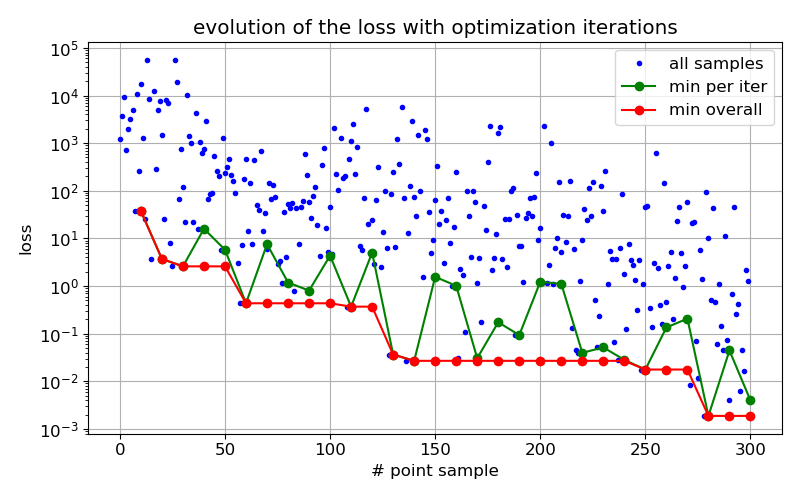
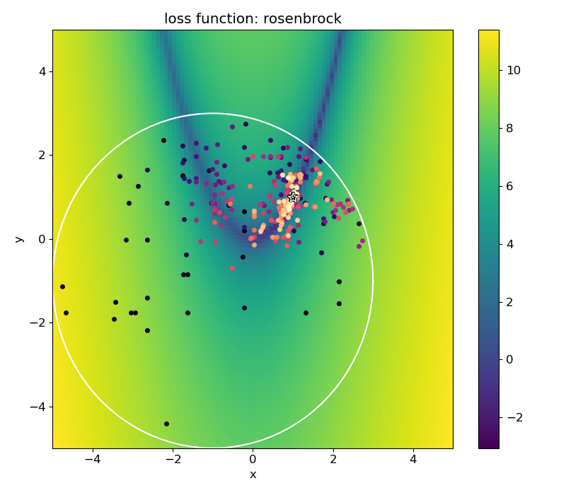

## Optimization

For Bayesian model calibration (BMC), it is first worthwhile to check that the model is able to represent
the data well. For this, we need to do optimization. 
Also, for the following step of MCMC it is recommended to start close to the minima anyway, 
which is also achieved in this step.

--- 

This example's plots are generated using [example_optimization.py](../example_optimization.py).

We choose the loss function as the 2d-rosenbrock function, with a circle constraint:

$$
\begin{aligned}
\min_{x,y} &\quad f(x,y)=(1 - x)^2 + 100(y - x^2)^2 \\
\text{subject to} &\quad (x + 1)^2 + (y + 1)^2 \leq 16
\end{aligned}
$$

The parallel optimization algorithms available to use are:
1. [Differential Evolution](https://en.wikipedia.org/wiki/Differential_evolution) via [``nevergrad``](https://github.com/facebookresearch/nevergrad)
2. [Particle Swarm Optimization](https://en.wikipedia.org/wiki/Particle_swarm_optimization) via [``nevergrad``](https://github.com/facebookresearch/nevergrad) 
3. [Bayesian Optimization](https://en.wikipedia.org/wiki/Bayesian_optimization) via [``botorch``](https://github.com/pytorch/botorch)

We will use the first algorithm in the list above (with default settings), and use ``num_workers=10`` for ``num_iters=30``.

Progression of the loss with the number of iterations (in blue is the loss for all the sampled points, grren for the minimum per iteration, and in red the overall minimum up to that iteration):

2d visualization of the loss function (log absolute of the values), 
the circle constraint (white line), 
and the points approaching (dark to bright) the minima (marked by a star):

In the example above the number of iterations was arbitrary, but for model calibration the loss function should be a 
measure of the model's fit to data, and the optimization goal is to reach a statistically satisfactory value before 
proceeding to the Bayesian model calibration (MCMC).
