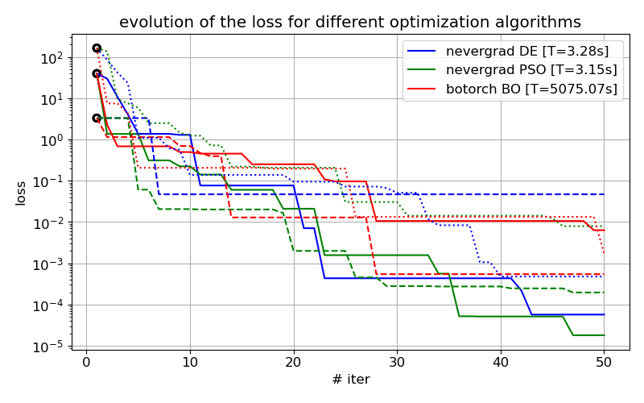
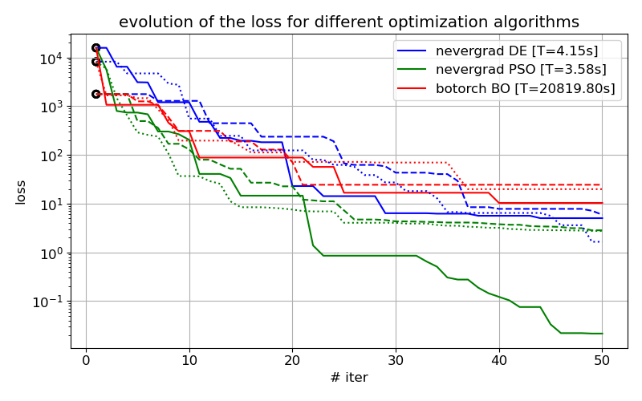
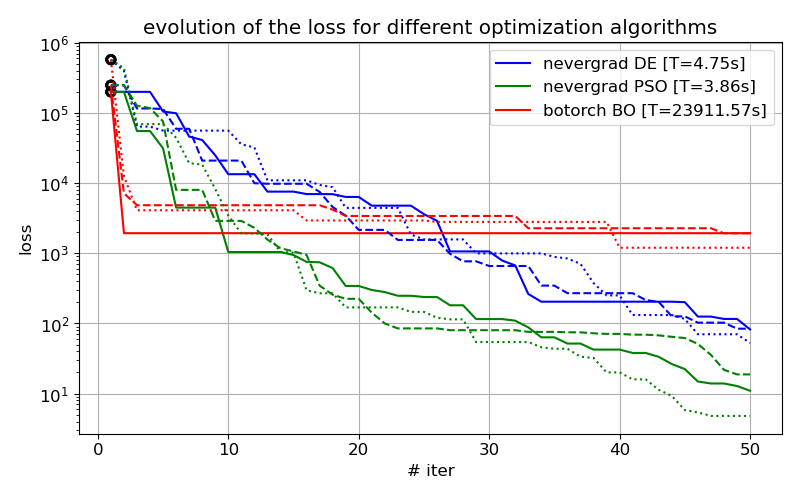

## Comparing Optimization Algorithms

This example's plots are generated using [example_optimization_algorithms_comparison.py](../example_optimization_algorithms_comparison.py).

We perform minimization on the rosenbrock function with $d$ parameters (without additional constraints):

$$
f(\mathbf{x}) = \sum_{i=1}^{d-1} \Bigl[ 100(x_{i+1} - x_i^2)^2 + (1 - x_i)^2 \Bigr]
$$

The analytic minima is known to be $f(\mathbf{x}\_{min})=0$ in $\mathbf{x}\_{min} = (1,\dots,1) \in \mathbb{R}^d$.
The chosen minimization domain is $\mathbf{x} \in [-10, 10]^d$.

In all the optimization runs we will use ``num_workers=50`` for ``num_iters=50``.

The optimization algorithms are their chosen settings:

1. [Differential Evolution](https://en.wikipedia.org/wiki/Differential_evolution) (DE) via [``nevergrad``](https://github.com/facebookresearch/nevergrad): use default settings.
2. [Particle Swarm Optimization](https://en.wikipedia.org/wiki/Particle_swarm_optimization) (PSO) via [``nevergrad``](https://github.com/facebookresearch/nevergrad) : use default settings.
3. [Bayesian Optimization](https://en.wikipedia.org/wiki/Bayesian_optimization) (BO) via [``botorch``](https://github.com/pytorch/botorch): use ``num_restarts=10`` and  ``raw_samples=100``.  

Note: in BO, each optimization step involves training a Gaussian Process surrogate model based on the past sampled points, to then use for the selection of future candidate points.
This process scales as $\mathcal{O}(n^3)$ with $n$ being the size of the data-set used for training, which could potentially significantly increase the computation time per iteration.
Therefore, in our implementation of BO in [botorch_optimizer.py](../slurmcmc/botorch_optimizer.py), we allow to trim the data-set size used to the ``num_best_points`` with the lowest loss values encountered so far.
However, by default (and in this example) we do not constrain the size of the data-set.

To initiate the minimization, 50 initial points will be randmoly chosen in the minimization domain, 
and for fair comparison, all 3 optimization algorithms begin at the same points (each algorithm indicated by a different color).
This is repeated for 3 separate sets of initial points (indicated by different linestyles).
The computation run-time (for a single full optimization run) is written in the legend in each case.

We perform this for different numbers of parameters $d$. 

For $d=2$:

For $d=5$:

For $d=10$:

PSO outperforms DE and BO on the tested loss functions. BO shows disproportionately high computational cost while rarely improving upon the alternatives (except briefly when $d=10$).